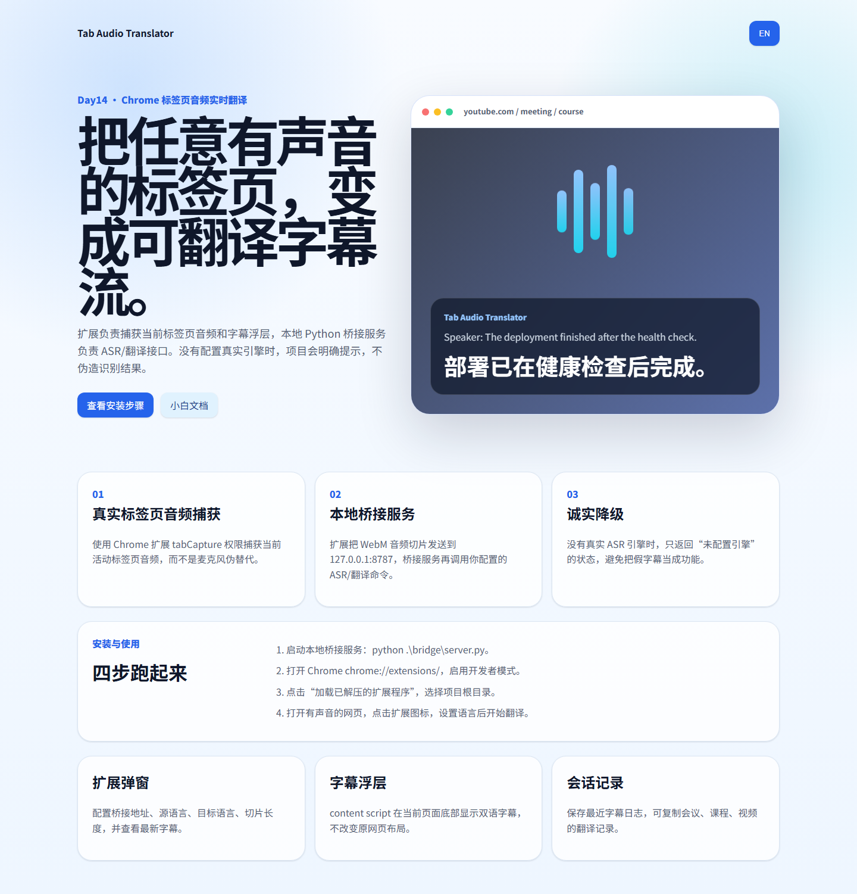
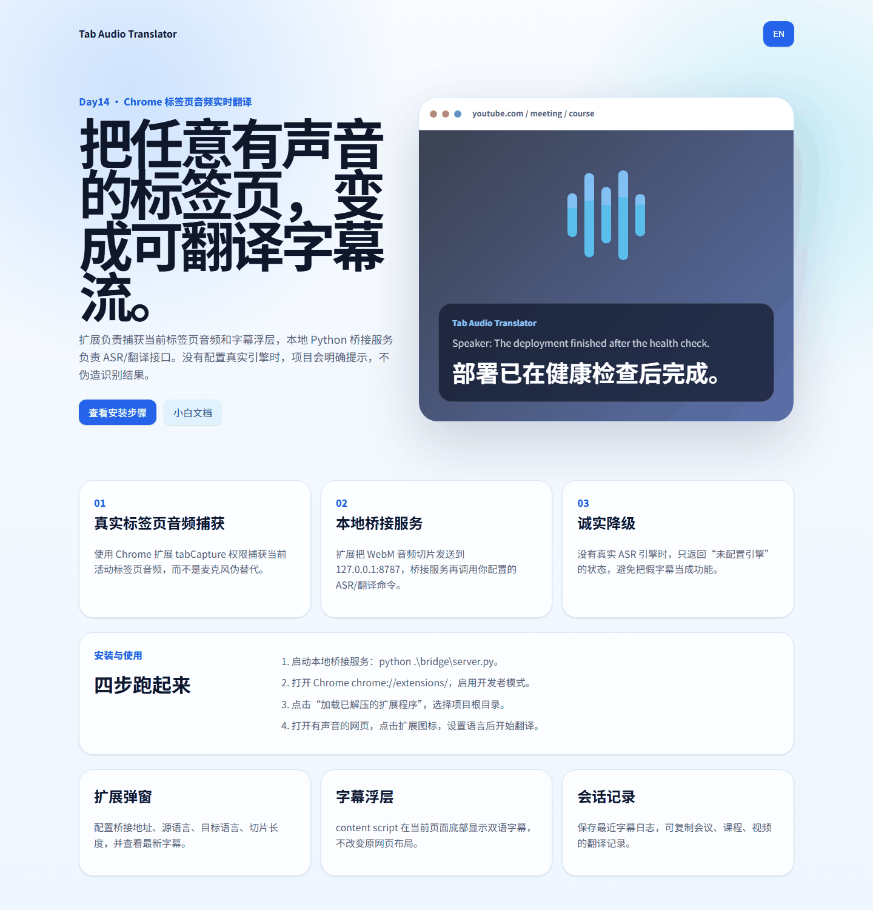

# Tab Audio Translator Day14





## 中文说明

### 这个项目是什么

Tab Audio Translator 是一个 Chrome 插件项目，用来捕获“当前标签页”的音频，把音频切片发送给本地桥接服务，再把识别/翻译结果显示成网页底部字幕浮层。

它不是普通网页工具，因为普通网页没有权限读取其它标签页的音频。真正的捕获链路必须运行在 Chrome 扩展里。

### 今天真实实现了什么

- Chrome Manifest V3 扩展结构。
- `tabCapture.getMediaStreamId()` + offscreen document 当前标签页音频捕获。
- `MediaRecorder` 音频切片，默认 WebM/Opus。
- 本地 Python 桥接服务：`/health` 和 `/translate-chunk`。
- 桥接服务支持 `TAT_ASR_COMMAND` 和 `TAT_TRANSLATE_COMMAND` 接入真实本地 ASR / 翻译命令。
- 页面字幕浮层 content script。
- 扩展弹窗控制台：桥接地址、源语言、目标语言、切片秒数、开始/停止、会话记录复制。
- GitHub Pages 展示页和双语切换。

### 没有伪造的地方

默认 Python 桥接服务不会假装能识别语音。如果没有配置真实 ASR 引擎，它会返回“未配置真实语音识别引擎”。这是故意的：实时音频翻译必须有 ASR 和翻译引擎，不能只做一个漂亮按钮。

### 创新点

这个项目把“标签页音频捕获、字幕浮层、本地 ASR/翻译桥接、诚实降级”组合成一个可扩展架构。它不是只能处理麦克风，也不是只能演示 UI，而是为任意有声音的 Chrome 标签页准备了真实捕获管线。

### 小白使用步骤

1. 安装 Python 3。
2. 在项目根目录运行：

```powershell
python .\bridge\server.py
```

3. 打开 Chrome，进入 `chrome://extensions/`。
4. 打开右上角“开发者模式”。
5. 点击“加载已解压的扩展程序”。
6. 选择本项目根目录 `tab-audio-translator-day14`。
7. 打开一个有声音的网页，比如课程、会议回放、视频。
8. 点击 Chrome 工具栏里的 Tab Audio Translator 图标。
9. 确认桥接地址是 `http://127.0.0.1:8787`。
10. 选择源语言和目标语言，点击“开始翻译”。
11. 如果没有配置 ASR，引擎会显示“未配置”，这是正常状态。
12. 配置真实 ASR 后，字幕会显示在当前网页底部。

### 已接入的免费本地 ASR 路线：whisper.cpp

针对没有 NVIDIA CUDA 的 Windows 电脑，本项目推荐 `whisper.cpp`。它已经配套了安装脚本和启动脚本。

安装 whisper.cpp、`base` 模型和 ffmpeg：

```powershell
.\tools\setup-whispercpp.ps1 -Model base
```

启动带本地 ASR 的 bridge：

```powershell
.\tools\start-bridge-whispercpp.ps1
```

验证成功后，`/health` 会显示：

```json
{"mode":"asr-only","asr_configured":true}
```

### 已接入的免费本地翻译路线：Argos Translate

安装英文到中文离线翻译包：

```powershell
.\tools\setup-argos-translate.ps1 -From en -To zh
```

启动完整本地流程：

```powershell
.\tools\start-bridge-full-local.ps1
```

验证成功后，`/health` 会显示：

```json
{"mode":"asr-and-translate","asr_configured":true,"translate_configured":true}
```

此时完整链路是：

```text
Chrome 标签页音频 -> whisper.cpp 本地识别 -> Argos Translate 本地翻译 -> 页面字幕浮层
```

### 当天参考来源

- Chrome tabCapture API: https://developer.chrome.com/docs/extensions/reference/api/tabCapture
- Chrome Extension audio capture / offscreen documents: https://developer.chrome.com/docs/extensions/how-to/web-platform/screen-capture
- Chrome Extensions Manifest V3 documentation: https://developer.chrome.com/docs/extensions/develop/migrate/what-is-mv3
- Web Speech API boundary reference: https://developer.mozilla.org/en-US/docs/Web/API/Web_Speech_API

## English

### What This Project Is

Tab Audio Translator is a Chrome extension project that captures audio from the current tab, sends audio chunks to a local bridge service, and renders recognized/translated captions as an overlay on the page.

It is not a normal web page tool. Normal web pages cannot read audio from arbitrary browser tabs. The real capture path must run inside a Chrome extension.

### Implemented Today

- Chrome Manifest V3 extension structure.
- Current-tab audio capture with `tabCapture.getMediaStreamId()` plus an offscreen document.
- Audio chunking through `MediaRecorder`, using WebM/Opus when available.
- Local Python bridge with `/health` and `/translate-chunk`.
- Bridge hooks for real local ASR and translation commands via `TAT_ASR_COMMAND` and `TAT_TRANSLATE_COMMAND`.
- Page caption overlay content script.
- Extension popup console with bridge URL, source language, target language, chunk length, start/stop, and log copy.
- GitHub Pages product page with Chinese / English toggle.

### Honest Boundary

The default Python bridge does not pretend to recognize speech. If no real ASR engine is configured, it returns a clear “ASR engine is not configured” message. This is intentional: real-time audio translation requires ASR and translation engines.

### Differentiator

This project combines real tab audio capture, caption overlay, local ASR/translation bridge hooks, and honest fallback behavior. It is not a microphone-only workaround or a fake UI demo.

### Beginner Steps

1. Install Python 3.
2. Run this in the project root:

```powershell
python .\bridge\server.py
```

3. Open Chrome and go to `chrome://extensions/`.
4. Enable “Developer mode”.
5. Click “Load unpacked”.
6. Select the `tab-audio-translator-day14` project root.
7. Open a web page with audio, such as a course, meeting replay, or video.
8. Click the Tab Audio Translator toolbar icon.
9. Confirm the bridge URL is `http://127.0.0.1:8787`.
10. Choose source and target languages, then click “Start translation”.
11. If ASR is not configured, the not-configured message is expected.
12. After connecting a real ASR command, captions appear at the bottom of the active page.

### Included Free Local ASR Path: whisper.cpp

For Windows machines without NVIDIA CUDA, this project recommends `whisper.cpp`. Setup and start scripts are included.

Install whisper.cpp, the `base` model, and ffmpeg:

```powershell
.\tools\setup-whispercpp.ps1 -Model base
```

Start the bridge with local ASR:

```powershell
.\tools\start-bridge-whispercpp.ps1
```

After success, `/health` returns:

```json
{"mode":"asr-only","asr_configured":true}
```

### Included Free Local Translation Path: Argos Translate

Install the English-to-Chinese offline package:

```powershell
.\tools\setup-argos-translate.ps1 -From en -To zh
```

Start the full local pipeline:

```powershell
.\tools\start-bridge-full-local.ps1
```

After success, `/health` returns:

```json
{"mode":"asr-and-translate","asr_configured":true,"translate_configured":true}
```

The full pipeline is:

```text
Chrome tab audio -> local whisper.cpp ASR -> local Argos Translate -> page caption overlay
```

### Same-Day Reference Sources

- Chrome tabCapture API: https://developer.chrome.com/docs/extensions/reference/api/tabCapture
- Chrome Extension audio capture / offscreen documents: https://developer.chrome.com/docs/extensions/how-to/web-platform/screen-capture
- Chrome Extensions Manifest V3 documentation: https://developer.chrome.com/docs/extensions/develop/migrate/what-is-mv3
- Web Speech API boundary reference: https://developer.mozilla.org/en-US/docs/Web/API/Web_Speech_API
